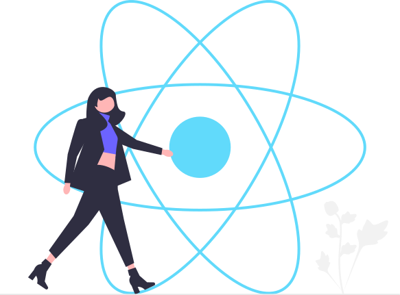

- 👋 Hi, I’m @UmutYG
- I am a student at Ankara University working on to be FullStack Developer ...
- 👀 I’m interested in coding espically with Node.js ...
- 🌱 I’m currently learning React.js deeply ...
- 📫 How to reach me -> umutyilmazgunduz@gmail.com ...

<!---
UmutYG/UmutYG is a ✨ special ✨ repository because its `README.md` (this file) appears on your GitHub profile.
You can click the Preview link to take a look at your changes.
--->

<h1 align="center"><b>Hi ,Umut Yılmaz Gündüz </b></h1>

  

 

	
## <picture></picture> **About me**

<picture>
  <source media="(max-width: 767px)" srcset="">
  
</picture>

 

- Hello, and welcome to my GitHub profile! My name is Umut Yılmaz Gündüz, and I am a self-taught front-end developer with a passion for creating engaging and user-friendly web applications. 

- Currently, I am pursuing a Bachelor's degree in Computer Science in Ankara University, where I am also learning and expanding my knowledge in software development.

- As a self-taught developer, I have taken the initiative to learn the latest technologies and techniques for creating dynamic and engaging user interfaces.

-  Through practice and experimentation, I have honed my skills in HTML, CSS, JavaScript.
  
-  Now, I focus on React.JS, Next.JS for Front-End and Node.js for the back-end.

- My portfolio on GitHub reflects my dedication to constantly learning and improving as a developer. I am always on the lookout for new challenges that will push me out of my comfort zone and help me grow my skills.

- I encourage you to take a look at my work on <a href="https://www.frontendmentor.io/profile/UmutYG">Frontend Mentor</a>, where I have completed several design challenges to showcase my abilities.

- My ultimate goal is to create innovative and user-friendly web applications that provide real value to users.

- I am always open to new ideas and opportunities to collaborate with other passionate developers. If you're interested in discussing potential projects or just want to say hello, feel free to reach out to me at <a href="mailto:umutyilmazgunduz@gmail.com">umutyilmazgunduz@gmail.com</a>

- Thank you for visiting my profile, and I look forward to connecting with you!

  

  

## <b> Skills</b>
 

- **Languages (I provide only the ones I use for web development)**:

    &nbsp;
    &nbsp;
    &nbsp;
  
     

    
    
- **Front-End Development**:

   &nbsp;
   &nbsp;
   &nbsp;
   &nbsp;
   &nbsp;
   &nbsp;

 

- **Back-End Development**:

   &nbsp;  
   &nbsp;
 

- **Databases**:
  
 

- **Softwares and Tools**:

    &nbsp;
    &nbsp;
    &nbsp;
    &nbsp;

 

 
 

-----

 

## <b> Github Stats </b>
 

 
 

-----

 
 

## <b> Let's Connect..!</b>
 

<ul>

<li>

</li>

 

<li>

</li>

 

<li>

</li>
	
</ul>

 

 
 
 

## <b>السَّلاَمُ عَلَيْكُمْ وَرَحْمَةُ اللهِ وَبَرَكَاتُهُ...✨</b>

 
 
